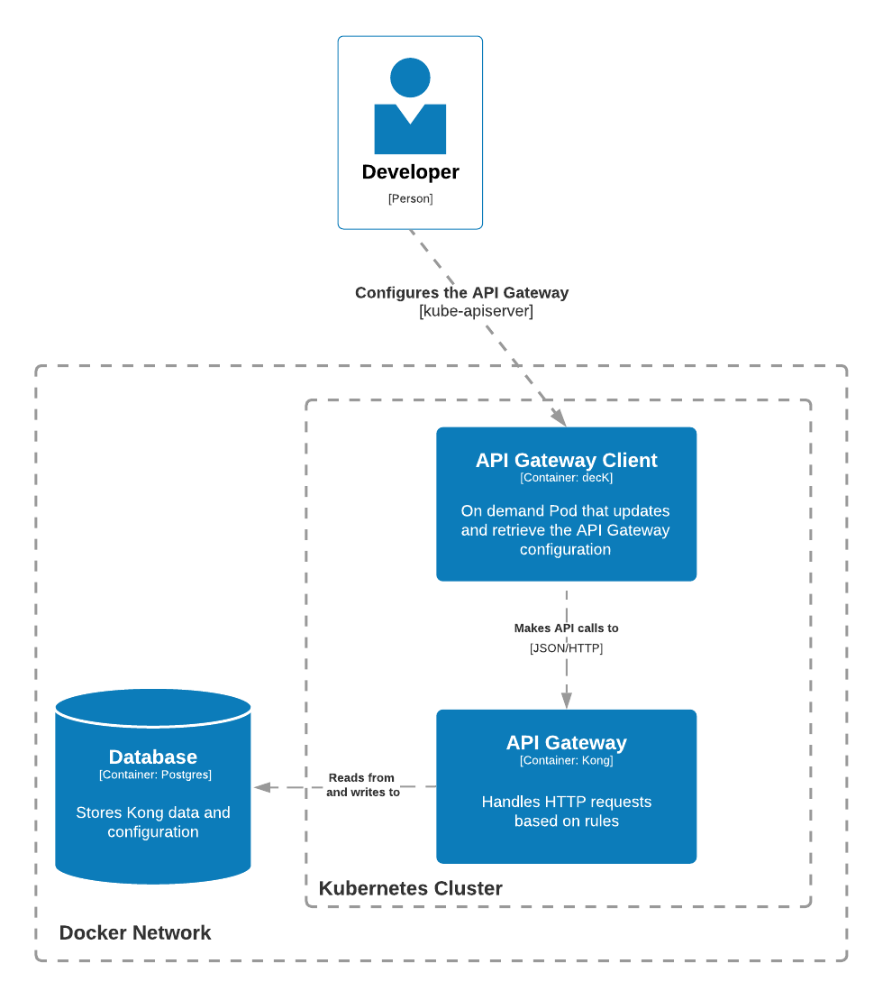

# Kong in Kubernetes

This project seeks to provide an initial structure for **developers** to work with **Kong API Gateway** in a **Kubernetes** cluster. This structure can be used to design, develop, and deploy microservices architectures in a **local development environment**. Nonetheless, it is a fresh and minimal environment perfect for learning about **Kong API Gateway**.

<div align="center">
    
</div>

## Goals

- **Local Kubernetes cluster**: use [Kind](https://kind.sigs.k8s.io/) to deploy a single node cluster.
- **Kong API Gateway with declarative configuration**: deploy [Kong OSS 2.6](https://docs.konghq.com/gateway/2.6.x/) with a database using Helm. The Admin API will be exposed through a ClusterIP, and a [Pod containing decK](https://hub.docker.com/r/kong/deck) will sync the local configuration file to Kong.
- **Learn about Kong API Gateway**: I believe that **an API Gateway enables different kinds of architectures** and Kong seems to offer a myriad of tools to both Free and Enterprise editions. Also, Kong allows developers to create custom plugins using Go, and I want to explore it.

## Out of Scope

- **Teach about Kubernetes**: this document assumes readers have previous knowledge of the orchestrator.
- **Production configuration**: this project is meant to be used for local development and personal projects. Although I have plans to elaborate a production-ready Kong and Kuberenetes environment.
- **Load Balancers**: I will rely on NodePorts because I do not want to add complexity to my local environment.

## Setup

### Create the Kubernetes cluster using `kind`

```
kind create cluster --config kind.yaml
```

It will expose the ports `8000` and `8443` on the running machine that are going to forward the HTTP requests to Kong's proxy.

### Launch the Postgres database in `kind` network

```
docker-compose up -d
```

### Create Service for external Postgres database

```
kubectl apply -f postgres/
```

### Install Kong in Kubernetes

```
helm repo add kong https://charts.konghq.com

helm repo update

helm install -n kong --create-namespace api-gateway kong/kong --set ingressController.installCRDs=false --values kong/values.yaml
```

### Sync local configuration to Kong

```
./deck-sync
```

Finally, check `http://localhost:8000/mock` in your browser
